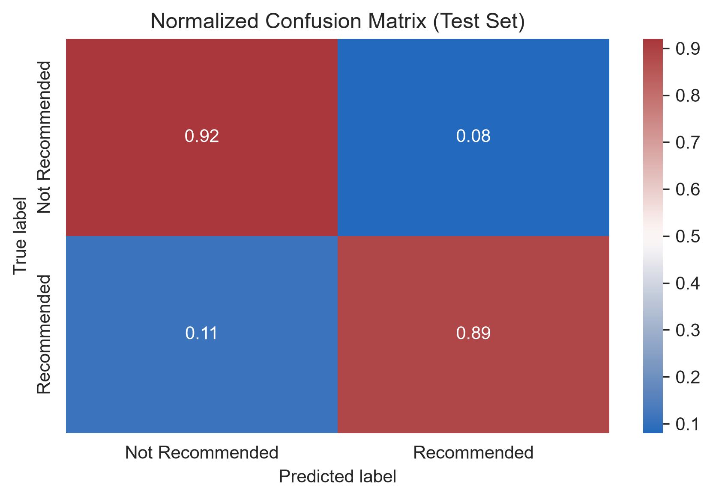

# Predicting Airline Recommendation

**Predicting Airline Recommendation**s is a machine learning project that predicts whether a customer would recommend
an airline based on the text of their review.

## **Business problem**

Airlines receive a large number of customer reviews every day. Manually analyzing these reviews is time-consuming and
makes it difficult to quickly identify negative customer experiences that require attention.

## **Project objective**

The objective of this project is to develop and evaluate a machine learning model that automatically classifies airline
reviews as `recommended` or `not recommended` based solely on the review text. The project compares several traditional
machine learning models and a transformer-based BERT model to evaluate different approaches to text classification.

Although the preprocessing pipeline supports both structured and textual features, the final model intentionally relies
only on review text in order to evaluate how much predictive information can be extracted from natural language alone.

## Project Pipeline

Raw data → EDA → Preprocessing → Baseline → Traditional models → BERT → Final model (LinearSVC) → Deployment

## Dataset

**Source:** [Airline Reviews Dataset](https://www.kaggle.com/datasets/juhibhojani/airline-reviews/data) (Kaggle)

**Original source:** [AirlineQuality](https://www.airlinequality.com)

**Original size:** 23,171 reviews, 20 features

**Target variable:** `Recommended` (`yes` / `no`)

The dataset contains customer reviews of airlines collected from [AirlineQuality](https://www.airlinequality.com).
Each review includes textual feedback together with additional information such as passenger type, seat class, service
ratings, flight details, and the recommendation label. The goal of this project is to predict the `Recommended` label
from the review text.
Before model training, the dataset was cleaned by removing duplicates, handling missing values, and preprocessing the
review text.

## Evaluation metrics

- The **F1-score** was chosen as the primary metric due to the moderate class imbalance in the dataset.
- **ROC-AUC** was used as a complementary metric to assess the model's discriminative performance.

## Approach & Tools

**Approach**

- Data cleaning and preprocessing
- TF-IDF vectorization of review text
- Model training and comparison (Logistic Regression, LinearSVC, LightGBM)
- Hyperparameter tuning with Optuna
- Fine-tuning and evaluation of a BERT model
- Model evaluation using F1-score and ROC-AUC
- Error analysis and feature importance interpretation

**Tools**

- Python
- pandas, NumPy
- scikit-learn
- Hugging Face Transformers
- PyTorch
- LightGBM
- Optuna
- Matplotlib, Seaborn

The Optuna study used for hyperparameter optimization is included in the repository (models/linearsvc_optuna.db) for
reproducibility.

## Model Comparison

| Model               | Validation F1 | Validation AUROC | Test F1 | Test AUROC |
|---------------------|--------------:|-----------------:|--------:|-----------:|
| Logistic Regression |         0.852 |            0.964 |       - |          - |
| LinearSVC           |         0.871 |            0.967 |       - |          - |
| LightGBM            |         0.851 |            0.962 |       - |          - |
| LinearSVC (final)   |         0.881 |            0.967 |   0.868 |      0.959 |
| BERT                |         0.899 |            0.975 |   0.886 |      0.969 |

## Results

### Final Test Performance (LinearSVC)

| Metric   | Value |
|----------|------:|
| F1-score | 0.868 |
| AUROC    | 0.959 |

### Confusion Matrix

The confusion matrix of the final LinearSVC model on the test set.

  

## Conclusions

* Although the **BERT** model achieved slightly better performance, the improvement was small compared to its much
  higher computational cost.
* **LinearSVC** was selected as the final model, achieving **F1 = 0.87** and **AUROC = 0.96** on the independent test
  set.
* Error analysis showed that most misclassifications were related to mixed reviews, inconsistent labels, and
  context-dependent language such as irony or sarcasm.
* The project demonstrates that a classical **TF-IDF** + **LinearSVC** pipeline can provide strong performance for text
  classification without requiring complex neural networks.

## Deployment

A simple deployment of the final LinearSVC model is available in the `deployment/` directory.

The deployment consists of:

- **Streamlit** – user interface for entering airline reviews.
- **FastAPI** – REST API serving the trained model.
- **scikit-learn Pipeline** – includes text preprocessing, TF-IDF vectorization, and the trained LinearSVC classifier.

Architecture:

```text
Browser → Streamlit → FastAPI → LinearSVC Pipeline
```

See `deployment/README.md` for deployment instructions.

## Installation

1. Clone the repository:

```bash
git clone https://github.com/tanyadlogush/Predicting_Airline_Recommendations.git
cd Predicting_Airline_Recommendations
```

2. Create and activate a virtual environment (optional but recommended).

3. Install the required packages:

```bash
pip install -r requirements.txt
```

## Usage

Run the notebooks in the following order:

1. `01_eda.ipynb`
2. `02_preprocessing.ipynb`
3. `03_baseline.ipynb`
4. `04_models.ipynb`
5. `05_bert.ipynb`

The deployment example is located in the `deployment/` directory.

## Requirements

All project dependencies are listed in `requirements.txt`.

Install them with:

```bash
pip install -r requirements.txt
```